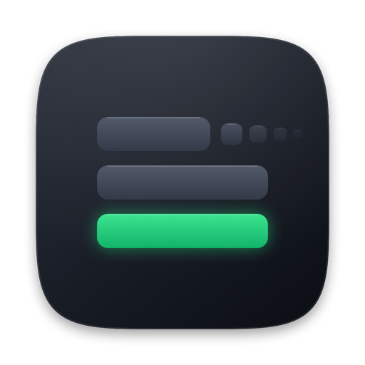
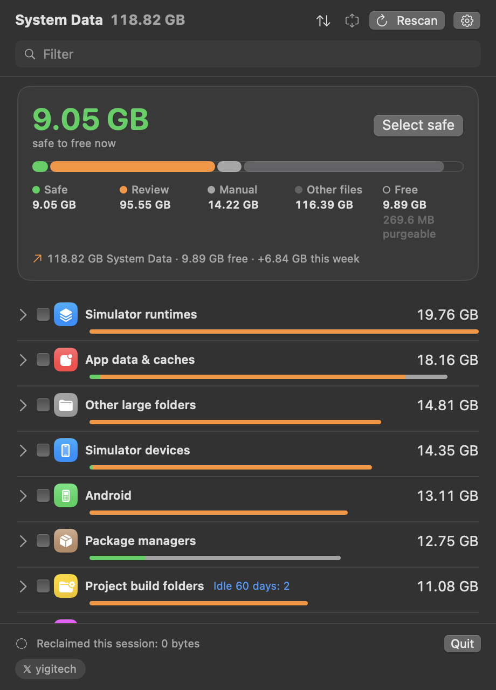

<p align="center">
  
</p>

<h1 align="center">System Data</h1>

<p align="center">
  A menu bar app that shows what is really inside macOS "System Data" and lets you delete it, item by item.<br>
  
  
  <a href="LICENSE"></a>
</p>

<p align="center">
  
</p>

---

Open System Settings > General > Storage on a developer Mac and "System
Data" is often the largest line, with no way to see inside it. Finder puts
everything it cannot attribute to an app, photos or documents in that bucket:
simulator runtimes, Xcode symbol caches, package-manager stores, virtual
machine disks, the unified log, per-app data folders.

This app opens the bucket. It is not a cache cleaner: `~/Library/Caches` is
one small line among fifty, and the app never deletes anything you did not
click.

## Install

```bash
brew install --cask Jarvis322/tap/sysdata
```

Or download `SysDataMenu-<version>.dmg` from the
[latest release](https://github.com/Jarvis322/macos-sysdata/releases/latest),
open it and drag the app onto Applications. A `.zip` of the same app is
attached to every release for anyone scripting the download.

Releases from 0.3.2 on are signed with a Developer ID and notarized by
Apple, so the app opens without a Gatekeeper prompt. From 0.3.7 the binary
is universal; 0.3.2 to 0.3.6 were Apple Silicon only and will not launch on
an Intel Mac.

Build from source (Xcode 16 or later):

```bash
git clone https://github.com/Jarvis322/macos-sysdata.git
cd macos-sysdata
scripts/build-app.sh
open build/SysDataMenu.app
```

The app has a **Launch at login** switch in its footer.

## What it does

- **Menu bar total.** The icon shows the size of everything the scan found,
  the number Storage settings calls System Data. The window header says how
  much of it is safe to free right now. It scans on launch and once a day.
- **Every item has a real size**, measured on disk, plus a badge:
  **Safe** regenerates automatically, **Review** costs you something (a
  simulator, a login, a re-download), **Manual** cannot be removed by the app
  and the info button shows the command or settings path.
- **Trash first.** Review items go to the Trash, so a wrong click can be
  undone for 30 days. Safe items are deleted outright because they come back
  on their own.
- **Breakdown.** Click a row to see its five largest entries before deciding.
- **Batch delete.** Tick rows and use **Delete N selected**; every root
  action in the batch is folded into one script, so the administrator
  password is asked once. **Select safe** ticks everything regenerable.
- **Hide.** The eye button removes an item from future scans (Ollama models
  you want to keep, say). A footer link brings hidden items back.
- **Purgeable space** is shown in the header, so the effect of deleting
  snapshots is visible.
- **Faster shutdown.** A booted iOS simulator ignores the quit request and
  makes macOS wait 33 seconds before killing it (`launchd`: "Service did not
  exit 33 seconds after SIGTERM"). Because the app is running at power off,
  it shuts every simulator down the moment the shutdown starts and only
  quits once that is done. Switch in the footer, on by default. Measured on
  a MacBook Air with three simulators booted: userspace teardown went from
  33,074 ms to 5,842 ms, the remaining 5 s being macOS's own service timeout.
  Check your own numbers after a restart with
  `grep "Userspace teardown took" /var/log/com.apple.xpc.launchd/launchd.log.2`.
- **Turkish** interface, following the system language.
- **`SysDataMenu --json`** prints the whole inventory for scripts.

## What it finds

| Category | Items | Badge |
| --- | --- | --- |
| Time Machine snapshots | local APFS snapshots (`tmutil`) | Safe |
| Simulator devices | per-device caches, unavailable devices, erase a device; the system dyld cache is reported (macOS blocks deleting it, even as root) | Safe / Review / Manual |
| Simulator runtimes | each installed runtime disk image | Review |
| Xcode | DerivedData, DeviceSupport, preview devices, caches, Archives, inactive Xcode.app copies | Safe / Review |
| Package managers | brew, npm, pnpm, yarn, pip, uv, CocoaPods, Gradle, Cargo, SwiftPM, Go, Cypress, Playwright; the whole Homebrew prefix | Safe / Manual |
| Developer tool data | Ollama and Hugging Face models, nvm/rustup/pyenv/rbenv/SDKMAN toolchains, conda, Maven, CocoaPods specs, Gradle distributions, Go modules, Bun, Deno, VS Code and Cursor extensions, Docker CLI, OrbStack, Lima, Colima, Claude Code, Codex; any other hidden home folder over 100 MB | Safe / Review |
| Logs & diagnostics | unified log store (`log erase`), crash reports, ASL, `~/Library/Logs` | Safe |
| Temporary files | `/private/var/folders` user cache and temp, files older than 3 days | Safe |
| Docker | `docker system prune` reclaimable space | Review |
| Virtual machines | Parallels, UTM, VMware Fusion, VirtualBox, Tart | Review |
| Trash | `~/.Trash` | Safe |
| iOS device backups | each MobileSync backup with device name and date | Review |
| Shared & other users | `/Users/Shared` app data (BlueStacks and friends), other accounts | Review / Manual |
| Android | AVD emulators, SDK system images, platforms, build tools, NDK, emulator, Android Studio caches | Review / Safe |
| App data & caches | Slack, Discord, Teams, Zoom, Spotify, Safari, Adobe, Steam, Epic, Photos, Quick Look and Final Cut render caches; Claude VM bundles; Chrome on-device model; any Application Support / Containers / Group Containers folder over 200 MB, caches over 100 MB | Safe / Review |
| Project build folders | `node_modules`, `.build`, `Pods`, `DerivedData` under Desktop, Documents, Developer, Projects | Review |
| System | macOS installers, device firmware, Mail downloads, `/Library/Caches`, `/Library/Application Support`, Command Line Tools, cryptexes, Spotlight index, swap, iCloud local copies | Safe / Review / Manual |
| Other large folders | catch-all: every folder over 500 MB under `~`, `/Library`, `/private/var`, `/opt`, `/usr/local` and `/Users/Shared` that no category above explains, shown with its full path | Review |

The catch-all pass runs last and takes the longest (it walks the home folder
once). The header shows which phase the scan is in. Folders Finder attributes
to Photos, Music, Movies, Messages, Mail, iCloud Drive and Applications are
skipped because they are not System Data.

## Permissions, once

Two things can prompt, and both can be settled one time:

- **Folder access.** macOS asks per protected folder (Desktop, Documents,
  Downloads, …) and silently hides Mail, Safari and Time Machine data. Grant
  **Full Disk Access** to the app in System Settings > Privacy & Security
  instead; the app shows a banner with a button until that is done. macOS
  quits the app when the grant is toggled, so reopen it afterwards. The grant
  is remembered by code-signing identity, which is why `scripts/build-app.sh`
  signs with your Developer ID or Apple Development certificate when one is
  in the keychain. An ad-hoc signature changes on every build and macOS would
  forget the grant each time. Override with `CODESIGN_IDENTITY="..."`.
- **Administrator password.** Needed for root actions. Batch them to be
  asked once per batch. Avoiding the prompt entirely would require a
  privileged helper daemon, which is deliberately out of scope for a small
  tool.

## Scripting

```bash
/Applications/SysDataMenu.app/Contents/MacOS/SysDataMenu --json > inventory.json
jq '.items[] | select(.safety == "safe") | [.name, .sizeBytes]' inventory.json
```

The output has `freeBytes`, `purgeableBytes`, `totalBytes` and one record per
item with `id`, `category`, `name`, `detail`, `sizeBytes`, `safety`,
`manual` and `path`.

`sysdata` is a bash script covering the Safe categories only, for machines
where you would rather not run an app:

```bash
./sysdata              # scan
./sysdata clean        # dry run
./sysdata clean --yes  # apply
```

## How it works

`Sources/SysDataMenu/Probes` holds one `StorageProbe` per category. Each
probe measures its locations with a single filesystem enumeration
(allocated blocks, no symlink traversal, the same numbers Finder uses) and
returns `StorageItem`s with a name, a size, a safety level and a
`ReclaimAction`: remove paths, empty directories, prune by age, run a tool's
own clean command, or run a script as root through the system authorization
dialog. Probes never mutate anything; `Reclaimer` is the only place that
deletes.

The catch-all probe receives every path the other probes claimed and reports
whatever large folder is left, so the inventory stays complete on machines
with software the app has never heard of. Adding a category means adding one
probe and registering it in `ProbeRegistry`.

Interface strings live in `Resources/Localizable.xcstrings`;
`scripts/compile-strings.sh` turns the catalog into the `.lproj` tables
SwiftPM ships, and a test checks that every key has a Turkish translation.

## Releasing

One command bumps `VERSION`, runs the tests, builds a signed and notarized
app, commits, tags, pushes, publishes the GitHub release with notes from the
commit log and updates the Homebrew cask:

```bash
scripts/release.sh          # patch
scripts/release.sh minor
```

It expects `gh` to be logged in and a notarytool keychain profile (once:
`xcrun notarytool store-credentials sysdata --key AuthKey.p8 --key-id ID --issuer ISSUER`).

## Requirements

macOS 14 or later. Xcode 16 or later to build. Xcode command line tools for
the simulator and Xcode categories; other tools are optional and skipped when
absent.

## License

Proprietary; see [LICENSE](LICENSE). The source is here to be read, not
reused: you can build and run it yourself, but copying, redistributing or
forking it for distribution needs written permission. Versions up to v0.3.7
were MIT and stay MIT.

Made by [@yigitech](https://x.com/yigitech).
